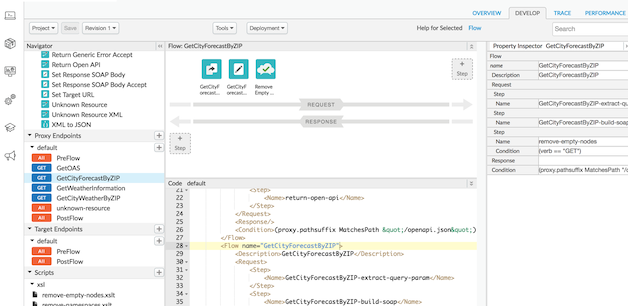
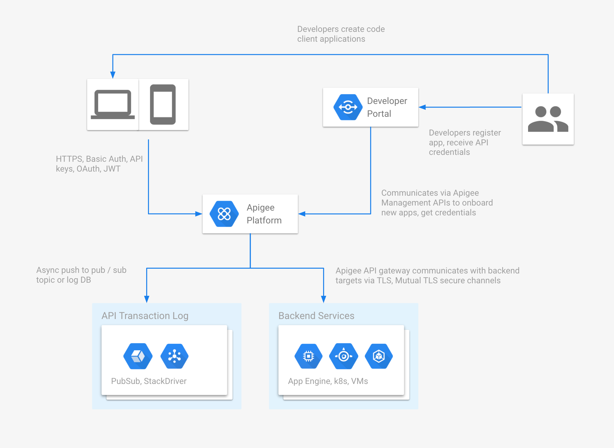

id: best-practices-hackathon

# Apigee Best Practices Hackathon

## Introduction

Welcome to the **Apigee Best Practices Hackathon**!

The main goal of this hackathon is to arm you with Apigee development best practices and to help you build better solutions for your clients. 

It is hands on session which focuses on the Apigee best practices and practical examples for day to day projects.

We assume the basic knowledge of Apigee platform and you will get the most from this hackathon if you do.

Ideally you will have completed the Coursera Apigee [Design](https://www.coursera.org/learn/api-design-apigee-gcp), [Development](https://www.coursera.org/learn/api-development-apigee-gcp) and [Security](https://www.coursera.org/learn/api-security-apigee-gcp) Courses.

Alternatively, completing the Apigee [API Jam](https://github.com/apigee/apijam) will cover the same topics in less depth.

Lets get started!

## Instructors

### Hello

Welcome! My name is Saulius Zukauskas and I'll be your instructor during this Apigee hackathon. Little bit of information about me:

-   Apigeek
-   Principal Platform Architect and partner at Apiscape
-   Over 10 year's experiance designing and building API first digital platforms for variety of globaly leading businesses.
-   Editor and author of enterprise technology courses and labs at [popularowl.com](https://popularowl.com)
-   Get in touch: [twitter.com/sauliuz](https://twitter.com/sauliuz) & [github.com/sauliuz](https://github.com/sauliuz)

## Prerequisites

### Structure

During this hackathon we will follow the practical business use case for building publicaly facing API endpoint on Google Apigee platfrom.

-   We have several timeboxed, practical API design and development tasks for all atendees to complete.
-   Instructor will follow up with with example implementation for the same tasks.
-   We discuss the best practices for task specifics and move on to the next one.
-   This hackathon is 3 hours long and we will have 5 minute breaks after each hour.

### Tools

Here are the prerequisites for completing the tasks:

-   Web Browser (recent version of [Chrome](https://www.google.com/chrome/) or [Firefox](https://www.mozilla.org/en-GB/firefox/new/))
-   Access to Apigee Account. It can be free Apigee [Evaluation Account](https://login.apigee.com/sign__up)
-   [Git](https://git-scm.com/book/en/v2/Getting-Started-Installing-Git), [Maven](https://maven.apache.org/) (3.0.2+), [Java JDK](https://java.com/en/download/manual.jsp) (8+) and [NodeJS](https://nodejs.org/) (10+)
-   A REST Client - [Postman](https://www.postman.com/) or [Curl](https://curl.haxx.se/)
-   Favourite text editor - Visual Studio [Code](https://code.visualstudio.com/), `vim`, etc.

### Best Practices

#### Web UI

Apigee has very useful web UI based Development Environment. Great for visual representation of Apigee APIs, configuration and real time tracing, web UI is being used in many Apigee online video tutorials for showcasing.

#### Apigee Management APIs

However, the best practices of Apigee API development lifecycle are built around utilising Apigee native management APIs for API development and releases. This allows to maintain:

-   Code version control
-   Use Continuous Integration and TDD / BDD patterns
-   Multiple developers / multiple teams environments.

In this hackathon we will use the tools and lifecycle commonly met in production grade Apigee projects.

## Scenario

During the hackathon we will follow the practical example of the fast growing fintech startup who uses multiple public APIs to support their business model.

### Global fintech startup

**We Move Your Money Fast** is a global fintech startup.

**We Move Your Money Fast** are providing their enterprise customers with a set of public Business APIs. Additional business API they want to introduce is Currency Exchange API. This API must provide a real time currency exchange rates as well as facilitate the actual currency exchange transactions.

**We Move Your Money Fast** have rapidly groving number of customers, therefore API security, API performance and API uptime are very important for them.

#### Considerations

Below are the are the main questions this customer has. They would like to see POC implementations to address these questions.

-   How will they apply the best API security practices to new Currency Exchange API hosted on Google Apigee?
-   How will they achieve the best Currency Exchange API performance?
-   How will customers be onboarded to use the Currency Exchange API?

In addition, in order to fit **We Move Your Money Fast** technology standards:

-   What are the best solution architecture patterns while using Google Apigee product?
-   How can they automate API deployment lifecycle and apply already used Continuous Integration pattern

## Architecture

### Architecture constrains

Apigee API gateway SaaS has the following constraints:

-   Apigee SaaS is hosted on the Public Cloud. All client applications and backend targets must also be hosted on the public Internet
-   VPNs and network peering are not supported between Apigee and backends.
-   At the transport layer, Mutual TLS is supported and recommend to secure target communications.
-   At the application layer, OAuth 2, JWTs or Basic Authentication can also be used

### Task

-   Draw own Architecture diagram indicating connections between architecture components. Focus on the data flows and communication security.
-   In order to make a copy the Google slide diagram above use the following url: <https://tinyurl.com/yak9vox2>
-   We have 5 minutes to complete the task [timer](https://www.google.com/search?q=timer&oq=timer).

## Architecture - Solution

### Flows between architecture components

-   Application developers are using Developer Portal to self register and retrieve API access credentials.
-   Client applications accessing public API hosted on Apigee will utilise TLS / HTTPS and potentially API keys, OAuth 2.0 access tokens, or signed JSON Web Tokens (JWT).
-   Apigee API gateway communicated directly to backend tarrget applications via TLS / Mutual TLS encrypted connection.
-   We asynchronously submit API request / response data to Pub / sub topic. These events can be picked up asyncronously by multiple processes and applications.

## Developer Environment Setup

### Apigee API Development Lifecycle

_This diagram is borrowed from the open source project - [Apigee / Maven / Jenkins CI Demo](https://github.com/apigee/maven-jenkins-ci-demo)_

### Setup considerations

-   Automation of Apigee API developmen lifecycle is achieved by utilising [Apigee Management APIs](https://apidocs.apigee.com/management/apis).
-   API on the Apigee platform is a zipped bundle with several configuration files and policy files in XML format which define the funcionality for specific API resource.
-   Apigee API developer day to day tasks are to create and update policies and API flow configuration files. And upload upload packaged code changes Apigee platform.
-   Apigee and external developer community have released multiple open source developer tools to simplify the project setup and development lifecycle. Here are some of such projects and tools.
-   [Apigee Maven Deploy Plugin](https://github.com/apigee/apigee-deploy-maven-plugin) and [Apigee NodeJS Tool](https://github.com/apigee/apigeetool-node) for automating API bundle deployment.
-   [Apigee Config Maven Plugin](https://github.com/apigee/apigee-config-maven-plugin) - for maintaining Apigee platform configurations (kvm's, caches, targets) as a code.
-   [Apigee template generator](https://github.com/apigee/devrel/tree/master/references/proxy-template) - generator for Apigee API template, uses Nodejs based apigeetool for deployments.
-   [Apigee Bootstrap](https://github.com/popularowl/apigeebootstrap) - is a lean framework to showcase the example Apigee template project setup. Uses Maven as deployment tool.

### Task

-   Goto Apigee Bootstrap GitHub page at <https://github.com/popularowl/apigeebootstrap>
-   Clone the project in the dedicated directory on you local machine

     git clone git@github.com:popularowl/apigeebootstrap.git

-   Setup local environment variables on your development machine

    export APIGEE_USERNAME=your username
    export APIGEE_PASS=your password

-   Navigate to the project directory and deploy the API to your Apigee organisation: 

    cd apigeebootstrap
    mvn install -P{environment name} -Dorganization={Apigee org name}

-   **Bonus:** rename the API to currency-api

-   We have 10 minutes to complete the task - [timer](https://www.google.com/search?q=timer&oq=timer).

## Backend Mocking

### Bottleneck - backend services

While we can configure and deploy new API funcionality in Apigee platform very fast, in many client projects we hit the bottleneck - backend services are not stable, not ready or do not exists yet.

In such cases, the best solution is to concentrate on fixing the version of interface specificcation with backend service and create the mocks representing such specification.

Great benefit of such approach - client application developers who rely on your API implementations will also be unblocked to proceed with their application development.

### Mocking

You host and build mocked API endpoints on Apigee platform using few methods.

-   [AssignMessage](https://docs.apigee.com/api-platform/reference/policies/assign-message-policy) policy - allows you to simply setup single mocked API response.
-   Javascript extention [Policy](https://community.apigee.com/articles/80296/simple-mocking-with-javascript-callout.html)
-   As Apigee supports Nodejs runtime environment via [hosted targets](https://docs.apigee.com/api-platform/hosted-targets/hosted-targets-overview) - multiple open source projects can be used for building more advanced API mocks on Apigee: [Nock](https://github.com/nock/nock), [Swagger tools](https://www.npmjs.com/package/swagger-tools), [API Mocker](https://github.com/laughingbiscuit/lbdk/tree/master/projects/apimocker-hostedtargets), [amockjs](https://github.com/sauliuz/amokjs) and others. Here is an [example reference code](https://github.com/apigee/devrel/tree/main/references/apimocker-hostedtargets) that uses apimocker to mock an API.
-   Stand alone mocking servers can also be used for more advanced API mocking setup. For example [WireMock](http://wiremock.org/).

### Task

-   Use [OpenAPI specification](https://swagger.io/specification/) and Swagger tools library to create 2 simple mock endpoints. The reference project to achieve this can be found [here](https://github.com/apigee/devrel/tree/main/references/apigee-sandbox-v1).
-   Follow TDD / BDD best practices using [Apickli](https://github.com/apickli/apickli) as API testing framework

#### Currency rates Mock

    GET /mock/api/currency/latest

    200 OK
    {
        "success": true,
        "base": "GBP",
        "date": "2020-07-01",
        "rates": {
            "AUD": 1.86,
            "CAD": 1.69,
            "CHF": 1.17,
            "CNY": 8.73,
            "EUR": 1.10,
            "JPY": 132.19,
            "USD": 1.23
        },
        "internal-traceidid": "123e4567-e89b-12d3-a456-426614174000"
    }

#### Convert Currency Mock

    GET /mock/api/currency/convert?from=GBP&to=EUR&amount=100

    200 OK
    {
        "success": true,
        "query": {
            "from": "GBP",
            "to": "EUR",
            "amount": 100
        },
        "info": {
            "timestamp": 1519328414,
            "rate": 1.10
        },
        "date": "2020-07-01"
        "result": 110,
        "internal-traceidid": "123e4567-e89b-12d3-a456-679914174111"
    }

-   We have 10 minutes to complete the task - [timer](https://www.google.com/search?q=timer&oq=timer).

## Traffic Management and Caching

### Usecase for API Caching

Apigee platform has inbuilt API response caching capabilities. It allows API developers to reduce API response latency by avoiding the request to backend server and send API response directly from Apigee platform layer.

-   Once backend data source TTL is well understood using caching in API gateway level is very beneficial for saving bandwith and reducing latency.
-   Apigee has flexible TTL management for cached objects and option to revoke cache.

### Other traffic management Policies

-   [Quata policy](https://docs.apigee.com/api-platform/reference/policies/quota-policy) allows to configure the number of request messages that an API proxy allows over a period of time, such as a minute, hour, day, week, or month.
-   [Spike Arrest](https://docs.apigee.com/api-platform/reference/policies/spike-arrest-policy) policy protects against suden traffic surges and can be configured with per second counter.

### Task

-   Add a new Spike Arrest policy to your project with 1ps rate.
-   Add a new [Response Cache](https://docs.apigee.com/api-platform/reference/policies/response-cache-policy) policy to improve response times.

Please note the following:

-   We should create our own `CacheResource` rather than using the default. This will allow us to clear the cache from the UI

-   We should be able to set a different cache TTL for each environment

-   We have 10 minutes to complete the task - [timer](https://www.google.com/search?q=timer&oq=timer).

## Response Transformation

### Internal data in response

You have probably noticed that our Currency conversion microservice response contains internal data related to transaction tracing pattern used in **We Move Your Money Fast** technology stack.

This is an internal transaction trace information used for auditing and transaction correlation. We do not want it to be present in the public API response.

    GET /mock/api/currency/latest

    200 OK
    {
        "success": true,
        "base": "GBP",
        "date": "2020-07-01",
        "rates": {
            "AUD": 1.86,
            "CAD": 1.69,
            "CHF": 1.17,
            "CNY": 8.73,
            "EUR": 1.10,
            "JPY": 132.19,
            "USD": 1.23
        },
        "internal-traceid": "123e4567-e89b-12d3-a456-426614174000"
    }

Apigee provides several inbuilt message transformation policies:

-   [JSON to XML policy](https://docs.apigee.com/api-platform/reference/policies/json-xml-policy)
-   [XML to JSON policy](https://docs.apigee.com/api-platform/reference/policies/xml-json-policy)
-   [XSL Transform policy](https://docs.apigee.com/api-platform/reference/policies/xsl-transform-policy)
-   [JavaScript policy](https://docs.apigee.com/api-platform/reference/policies/javascript-policy) - great for JSON object transformation.

### Task

-   Use JavaScript extension remove the `internal-traceid` element from public API response payloads. 
-   Follow quality best practices: unit testing.
-   Ensure code is consistent with linting.
-   Follow the BDD best practices for integration testing.
-   We have 10 minutes to complete the task - [timer](https://www.google.com/search?q=timer&oq=timer).

## Deploying to Production

### Production Hardening

-   Separation of production environments. Possible logical separation with separate Apigee organizations or physical separation with the dedicated infrastructure. API lifecycle infrastructure (like CI) might have to be also handled on the separate prod environment.
-   Best practices of managing environment configurations (KVMs) and Cache setup.
-   Best practices of rolling back the prod deployments.
-   Deploy APIs to PROD environment.

### Task

-   Move 1ps Spike Arrest value to be dynamically extracted from KVM.
-   Move from hardcoded target Urls to Target Servers.
-   Setup prod smoke tests with CucumberJS tags.
-   Deploy API bundles to the production environment.
-   We have 10 minutes to complete the task - [timer](https://www.google.com/search?q=timer&oq=timer).

## BONUS Publishing in a Developer Portal

### Developer portal considerations

Developer portals allow to publish your APIs to developer community. They allow for external developers to self onboard, get API credentials, read API documentation and download related code samples.

Apigee has developed open source Drupal modules to allw Drupal CMS be used as powerful API developer portal.  

### Task

-   Create a POC of [Developer Portal](https://docs.apigee.com/api-platform/publish/drupal/open-source-drupal-8) by using[Apigee Drupal Kickstarter](https://github.com/apigee/docker-apigee-drupal-kickstart) instance to demonstrate the extensibility of the portal to the marketing teams.

-   We have 15 minutes to complete the task - [timer](https://www.google.com/search?q=timer&oq=timer).

